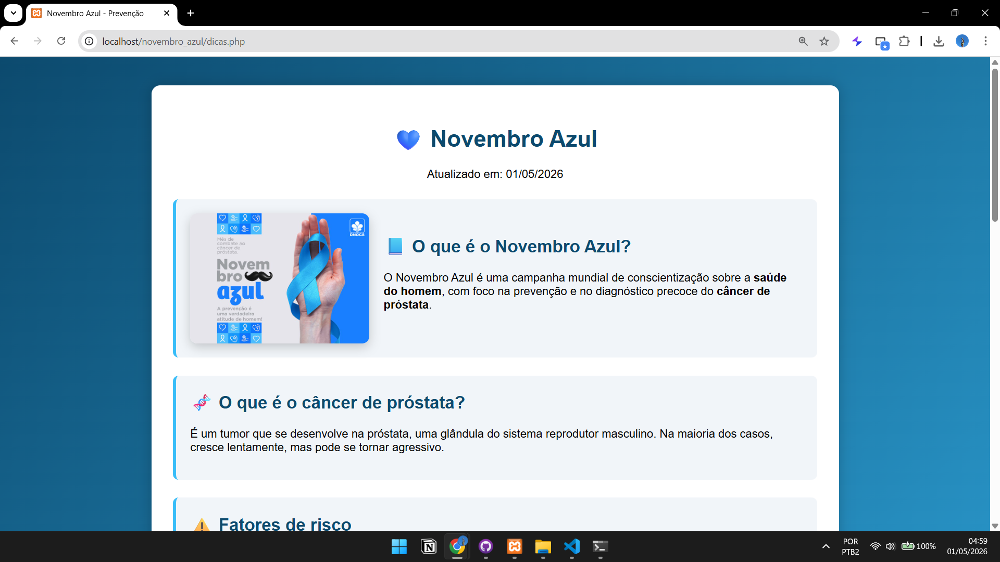

# 💙 Novembro Azul — Página de Conscientização


Projeto desenvolvido com o objetivo de conscientizar sobre a saúde masculina e a prevenção do câncer de próstata, utilizando uma página web simples, informativa e acessível.

---

## 📸 Preview do Projeto

<p align="center">
  
</p>

---

## 📑 Índice

* [🧠 Objetivo](#-objetivo)
* [🖥️ Tecnologias Utilizadas](#️-tecnologias-utilizadas)
* [📂 Estrutura do Projeto](#-estrutura-do-projeto)
* [🚀 Como Executar](#-como-executar)
* [🎯 Funcionalidades](#-funcionalidades)
* [🚧 Status do Projeto](#-status-do-projeto)
* [👨‍💻 Autor](#-autor)
* [📜 Licença](#-licença)

---

## 🧠 Objetivo

Apresentar informações essenciais sobre o **Novembro Azul** de forma clara e direta, incluindo:

* O que é a campanha Novembro Azul
* Explicação sobre o câncer de próstata
* Fatores de risco
* Sintomas
* Dicas de prevenção
* Quando procurar um médico
* Conteúdo educativo em vídeo

---

## 🖥️ Tecnologias Utilizadas

* HTML5
* CSS3
* PHP (estrutura da página)
* XAMPP (ambiente local)

---

## 📂 Estrutura do Projeto

```
novembro_azul/
│
├── dicas.php
├── assets/
│   └── preview.png
└── README.md
```

---

## 🚀 Como Executar

1. Instale e abra o XAMPP
2. Inicie o módulo Apache
3. Coloque o projeto em:

```
C:\xampp\htdocs\novembro_azul
```

4. No navegador, acesse:

```
http://localhost/novembro_azul/dicas.php
```

---

## 🎯 Funcionalidades

* 💡 Conteúdo educativo sobre saúde masculina
* 🧬 Explicação simples sobre câncer de próstata
* ⚠️ Informações sobre fatores de risco e sintomas
* 🛡️ Dicas de prevenção
* 🎥 Vídeo educativo incorporado
* 📱 Layout responsivo (adaptado para celular)

---

## 🚧 Status do Projeto

Este projeto está em fase de melhoria contínua.
A versão atual apresenta uma página informativa funcional sobre o Novembro Azul, com foco em conscientização e prevenção.

Novas funcionalidades e melhorias visuais poderão ser adicionadas futuramente.

---

## 👨‍💻 Autor

**Italo Souza**

**Curso:** Análise e Desenvolvimento de Sistemas

> "Prevenir é um ato de coragem. Cuide da sua saúde."

---

## 📜 Licença

Este projeto está licenciado sob a Licença MIT.
Sinta-se livre para usar, modificar e compartilhar, mantendo os devidos créditos ao autor.
